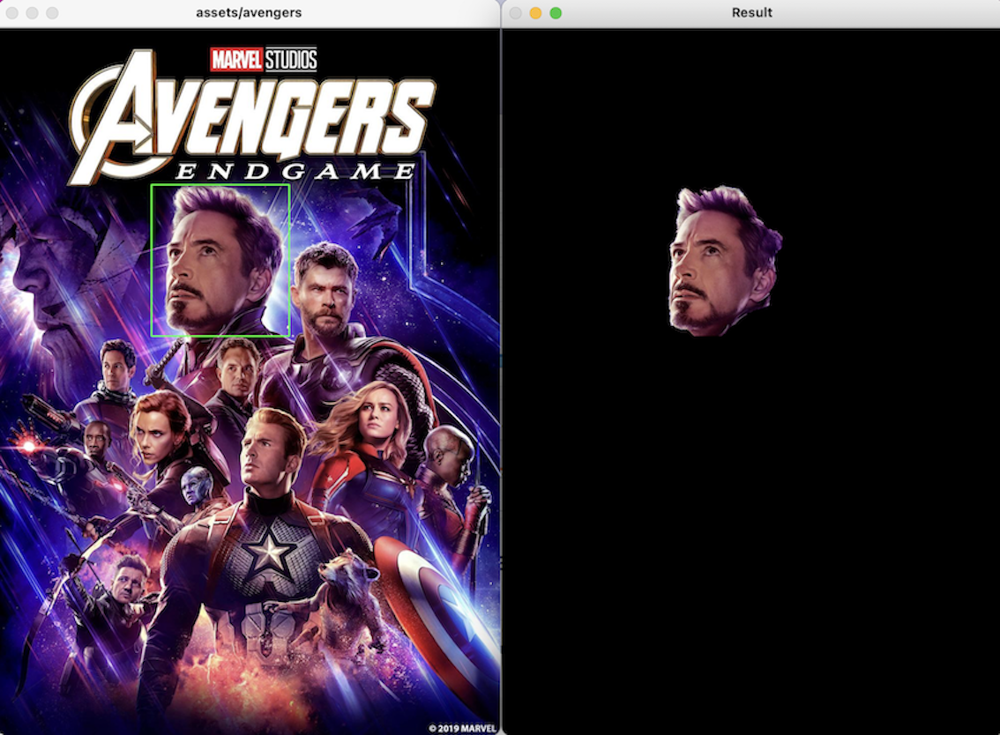

# Foreground Extraction with OpenCV and GrabCut Algorithm
Il seguente repo contiene il progetto realizzato per la tesina svolta per il corso di Intelligenza Artificiale A.A. 2021/2022.

L’estrazione interattiva in primo piano su un'immagine avviene disegnando un rettangolo contenente la regione in primo piano da estrarre. Tale rettangolo viene dato in input all'algoritmo GrabCut presente all'interno della libreria OpenCV e viene restituita una nuova immagine contenente la regione in primo piano all’interno del rettangolo disegnato.

GrabCut è un metodo di segmentazione delle immagini basato sui tagli dei grafi che non fa uso di tecniche di Machine Learning. Nella Computer Vision la segmentazione è una delle elaborazioni delle immagini cha avviene a livello intermedio. 

Testato con:
```
numpy 1.23.0
opencv_python 4.6.0.66
python 3.9.2
```

## Getting Started 
```bash
$ git clone https://github.com/mgranchelli/foreground-extraction.git
$ pip install -r requirements.txt
$ cd ./foreground-extraction
```

## Basic Usage
```bash
$ python3 foreground-extraction.py -i path-image
```
Nella finestra che mostrerà l'immagine è possibile disegnare un rettangolo con il mouse che conterrà la regione da segmentare e si aprirà una nuova finestra contenente la nuova immagine segmentata.
Se `-i path-image` non specificato verrà aperta l'immagine di default [*avengers.jpeg*](https://github.com/mgranchelli/foreground-extraction/blob/master/assets/images/avengers.jpeg).
Per chiudere il processo digitare `q`.

## Example
Test effettuati:
```bash
$ python3 foreground-extraction.py
```


```bash
$ python3 foreground-extraction.py
```


```bash
$ python3 foreground-extraction.py -i assets/images/jon-snow.jpeg
```
